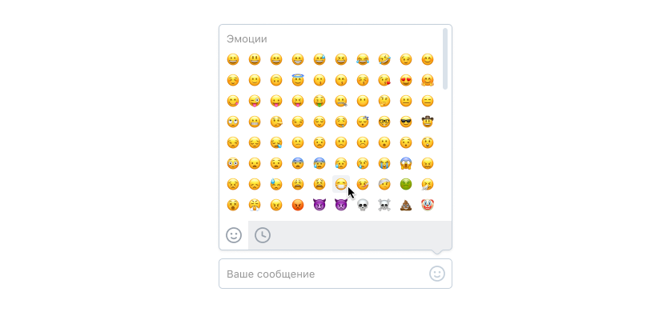

# ВКонтакте на практике.

## Тестовое задание на стажировку по фронтенду в команду «Веб-мессенджер»

Вам нужно разработать поле ввода с интерфейсом для добавления эмоджи.

- Поле ввода должно изменять размер под введённый текст.
- При нажатии на иконку справа должен открываться выпадающий интерфейс выбора эмоджи.
- В интерфейсе выбора эмоджи внизу есть 2 иконки. Они переключают режим просмотра между всем списком и недавно использованными эмоджи (можно запоминать, например, последние 25 использованных).

## Пожелания

- Постарайтесь сделать максимально удобный для пользователя интерфейс.
- Подумайте про управление с клавиатуры и доступность.
- Помните про скорость загрузки и производительность.

## Если оказалось слишком просто

Можно сделать дополнительное задание: находить и подсвечивать в поле ввода меншены, хештеги, ссылки и адреса электронной почты.

## Результат

В результате мы ожидаем увидеть html-страницу или веб-приложение со всеми необходимыми ресурсами.

- Вы можете использовать фреймворк для UI, если хотите.
- Вы можете использовать сторонние зависимости, если считаете это необходимым, но помните, что мы хотим увидеть именно ваш скилл.
- Результат, оформленный в виде репозитория (например, Github), будет плюсом.
- Результат, выложенный на любой удобный хостинг (например, Heroku), будет плюсом.

## Ресурсы

- [Дизайн в Figma](https://www.figma.com/file/ByVkK6PeZzHobVGHANVwGM/EmojiPicker?node-id=0%3A1)
- [Данные для отображения](https://github.com/Chaptykov/VKFrontendTask/blob/main/sections.json)
